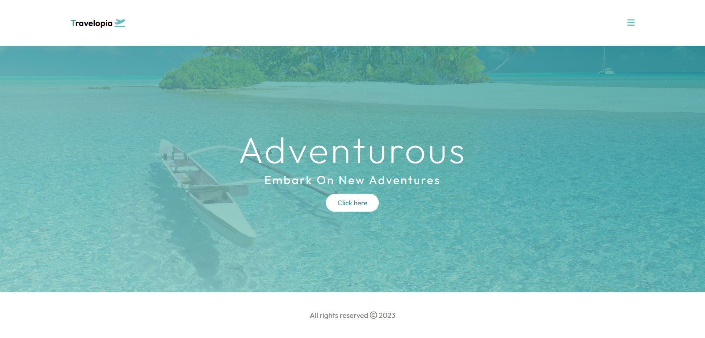

## Introduction

Welcome to the Travelopia website repository! At Travelopia, we pride ourselves on being travel experts, leading the way in providing unique and unparalleled travel experiences. Our diverse range of brands offers the world’s best polar expeditions, wildlife safaris, cultural tours, yachting adventures, and more.

The Travelopia website is designed for travelers who seek adventurous insights and want to explore new destinations. The platform provides a user-friendly interface to navigate through various sections, view destinations, and share feedback.

...

## Features

- Responsive design for various devices
- Navigation menu with Home, Destination, and Feedback sections
- Popup with adventurous insights and interactive button
- Social media links in the footer
- Animation effects for a smoother user experience

## Live Link -  https://travelopia-adventure.netlify.app/
